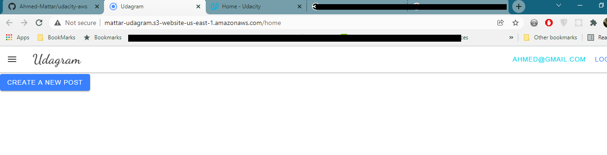
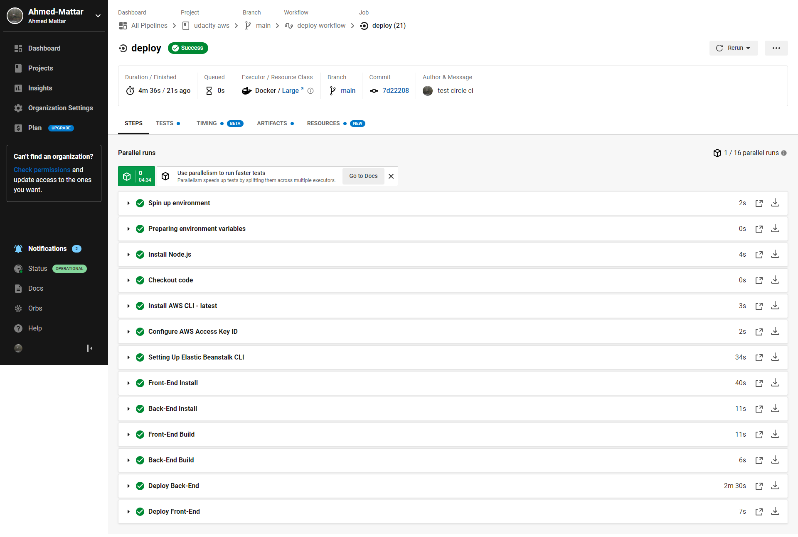

# Udagram

This project is part of the Udacity FullStack JavaScript nanodegree it's the last project and it's aim is to use aws services to host a full stack application.

The project is available at

http://mattar-udagram.s3-website-us-east-1.amazonaws.com

## Configuration Screenshots

### proof the site is working and connected to the backend

logged in with a made email

### Elastic Beanstalk Environment

### FrontEnd S3 Bucket

### PostgreSQL RDS database

### CircleCI Pipeline

added secrets here

## schema

1- Prepare environment: setup Node,npm,aws,EBcli
2- Install: Run npm install for both front-end and back-end
3- Build: Run build for front-end and back-end
4- Deploy: Deploy the front-end to s3 and the back-end to elasticbeanstalk

### Architecture

## Built With

- [Angular](https://angular.io/) - Single Page Application Framework
- [Node](https://nodejs.org) - Javascript Runtime
- [Express](https://expressjs.com/) - Javascript API Framework
