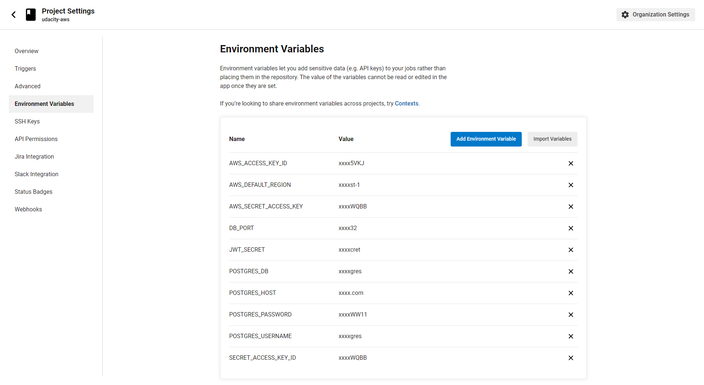

# Udagram

This project is part of the Udacity FullStack JavaScript nanodegree.

The project is available at

http://mattar-udagram.s3-website-us-east-1.amazonaws.com

See additional documentation in the documentation folder.

## Configuration Screenshots

### Elastic Beanstalk Environment

### FrontEnd S3 Bucket

### PostgreSQL RDS database

### CircleCI Pipeline

added secrets here

Schema

### Architecture

## Built With

- [Angular](https://angular.io/) - Single Page Application Framework
- [Node](https://nodejs.org) - Javascript Runtime
- [Express](https://expressjs.com/) - Javascript API Framework

## License

[License](LICENSE.txt)
