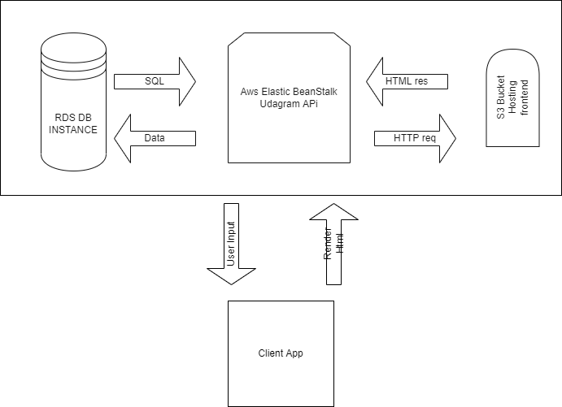

# Infrastructure

## AWS services in use

- **RDS**
  - Amazon Relational Database Service (Amazon RDS) makes it easy to set up, operate, and scale a relational database in the cloud. It provides cost-efficient
- **S3**
  - Amazon S3 or Amazon Simple Storage Service is a service offered by Amazon Web Services that provides object storage through a web service interface. Amazon S3 uses the same scalable storage infrastructure that Amazon.com uses to run its global e-commerce network
- **Elastic Beanstalk**
  - provides the backend (code) hosting

## Infrastracture Schema

